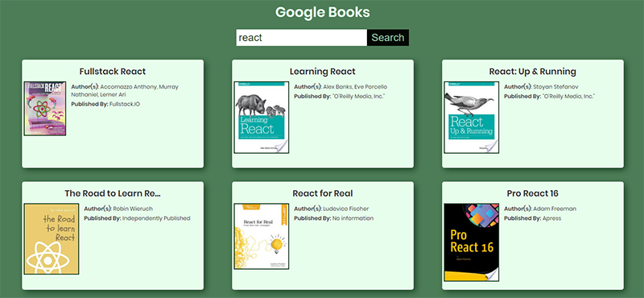

# Google Book API Search
By Carlos Fins

## Live Project
Demo of the project can be found here: [Google Book Reads](https://clockwerkz.github.io/google-book-reads/)

## Project Info

This project was completed for the initial Pre-Work requirements for the Chingu Cohort Voyage #8. The Task was to create a Front End Page using the Google Books Open API. I used React for this project.

## Installation and Dependencies
In order to install, simply clone or download the project by pressing the green *Clone Or Download* button above. 
Once downloaded, run npm install from the root of the project folder.
**Node** and **NPM** are required in order to build/run the project locally.

## Licensing
This project is licensed under the Creative Commons Licensing. You are free to:

* Share - copy and redistribute the matertial in any medium or format

* Adapt - remix, transform, and build upon the material for any purpose, even commercially. 